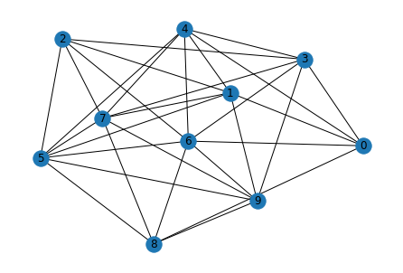
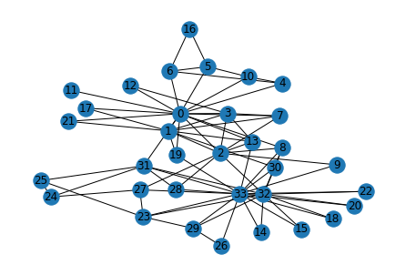

<script type="text/javascript" async
  src="https://cdn.mathjax.org/mathjax/latest/MathJax.js?config=TeX-MML-AM_CHTML">
</script>


# Implementing a Graph Neural Network from Scratch

In this notebook we'll try to implement a simple message passing neural network (Graph Convolution Layer) from scratch, and a step-by-step introduction to the topic.

[](https://colab.research.google.com/github/shindeshu/gnn_from_scratch.ipynb)

If you are unfamiliar with GNNs in general, please go through my small [intro blogpost](https://shindeshu.github.io/gnn_posts/intro_gnn.html). Message Passing is one of the more popular concepts in GNNs, and that is what we'll try to implement here. Specifically we are implementing the Graph Convolutional Layer/Network proposed by Kipf et al in 2016. You can go through a detailed [blogpost](https://tkipf.github.io/graph-convolutional-networks/) of his or the [original paper](https://arxiv.org/abs/1609.02907).


## Representing a Graph

Before we start on to Graph convolutions, let's first present it out on how do we represent a graph in code. Mathematically, a graph is defined as a tuple of a set of nodes/vertices , and a set of edges/links . Further, each edge is a pair of two vertices, and represents a connection between them.

Visually, a graph would look something like this: 

<center width="100%" style="padding:10px"></center>

The vertices are , and edges .

There are many ways to represent graphs in memory- two of them include "adjacency matrix" ($$a$$) and "edge list". If the number of nodes is $$n$$, the adjacency matrix is $$n x n$$. If there's an edge from node $$n_i$$ to $$n_j$$, the element $$a_{ij}$ is equal to 1. Likewise, the other elements of $$a$$ are populated.

```python
[[ 0 1 0 0 ]
 [ 1 0 1 1 ]
 [ 0 1 0 1 ]
 [ 0 1 1 0 ]]
```

Working with adjacency matrix for graph operations is easier, although they have their limitations. While established libraries like ```dgl``` or ```pytorch-geometric``` use edge-list format of data, here we are working with an adjacency matrix.

## Graph Convolutions

Graph convolutions are somewhat similar to image convolutions, in that they take their neighbourhood information and aggregate to get a richer understanding of their position. Also, the "parameters" of the filters are shared across the entire image, which is analogous to a graph convolution as well, where the parameters are shared across the graph.

GCNs rely on the message passing paradigm. Each node has a feature vector associated with it. For a given node u, each of its neighbouring nodes $v_i$ send a message derived from its feature vector to it. All these messages are aggregated alongwith its own feature vector, and this is used to update this node $u$ to get the final feature vector (or embedding).

## Current Implementation 

Each node has a feature vector. This feature will be projected using a linear layer, output of which will be the message that each node passes. We will represent the graph as an adjacency matrix, and multiply by the node features (projected) to perform the message passing. This will be divided by the number of neighbours for normalizing, which will give us the output of our first graph convolution layer.

Importing all our libraries. We are not using libraries like ```dgl``` or ```pytorch-geometric```, we will be using plain pytorch. We are also using ```networkx``` for manipulating graph.

We will be a creating a random matrix as an adjacency matrix. Creating a matrix with uniform_ method and the bernoulli method.


```python
nodes = 10
node_features_size = 4
```


```python
adj = torch.empty(nodes, nodes).uniform_(0, 1).bernoulli()
```

Visualizing the graph we created with networkx library


```python
graph = nx.from_numpy_matrix(adj.numpy())
graph.remove_edges_from(nx.selfloop_edges(graph))
```

```python
pos = nx.kamada_kawai_layout(graph)
nx.draw(graph, pos, with_labels=True)
```
    

    

Creating random features for our nodes. These features will go through a dense layer and then act as our messages.


```python
node_features = torch.empty(nodes, node_features_size).uniform_(0, 1).bernoulli()#.view(1, nodes, node_features_size)
node_features
```

The features will pass through a linear layer to create our messages


```python
projector = nn.Linear(node_features_size, 5)

node_feat_proj = projector(node_features)

num_neighbours = adj.sum(dim=-1, keepdims=True)
```


```python
torch.matmul(adj, node_feat_proj)/num_neighbours
```


    tensor([[-0.5067, -0.2463, -0.0555,  0.2188,  0.4031],
            [-0.8397,  0.0945,  0.5124,  0.1179, -0.0296],
            [-0.6457,  0.2369,  0.5048, -0.0216,  0.1531],
            [-0.9893,  0.4223,  0.7235,  0.3212, -0.1165],
            [-0.5876,  0.2246,  0.5227, -0.1519,  0.1979],
            [-0.6133, -0.0359,  0.2532,  0.0760,  0.2250],
            [-0.7740,  0.2055,  0.5252,  0.1075,  0.0174],
            [-0.7827,  0.1653,  0.5654,  0.0135, -0.0155],
            [-0.8635,  0.3189,  0.6940,  0.0758, -0.0423],
            [-0.9374,  0.2670,  0.6672,  0.1805, -0.1292]], grad_fn=<DivBackward0>)


```python
adj.shape, node_feat_proj.shape
```


    (torch.Size([10, 10]), torch.Size([10, 5]))


## A Note on Above Multiplication Operation

How it does achieve our objective, i.e. summing up of messages from neighbouring nodes of a particular node?

For simplicity, lets take an example where the adj matrix is $$ 7 \times 7$$ and the message matrix is $$ 7 \times 5 $$.

Consider a single row from the adjacency matrix, that corresponds to a node $$n_i$$. It might look something like
$$
A = \begin{bmatrix}
    0 & 1 & 0 & 0 & 1 & 0 & 1\\
\end{bmatrix}
$$

And the message matrix is $$7 \times 5$$. (seven rows, five columns).

For this node, we can observe there are edges existent only for nodes $${2, 5, 7}$$. When we multiple the above matrix with the message/feature matrix, we will get the elements corresponding to those indexes summed up (since others are multiplied by zero), along the second axis of the feature matrix i.e. we will get a $$1 \times 5$$ size vector.

Here, you can see that only the neighbouring nodes' features have been summed up to get the final d-length vector.


## Putting It All Together

Now that we've done it step-by-step, let us aggregate the operations together in proper functions.


```python
class GCNLayer(nn.Module):
    def __init__(self, in_feat, out_feat):
        super().__init__()
        self.projector = nn.Linear(in_feat, out_feat)

    def forward(self, node_features, adj):
        num_neighbours = adj.sum(dim=-1, keepdims=True)
        node_features = torch.relu(self.projector(node_features))
        node_features = torch.matmul(adj, node_features)
        node_features = node_features / num_neighbours
        node_features = torch.relu(node_features)
        return node_features
```


```python
layer1 = GCNLayer(node_features_size, 8)
layer1(node_features, adj).shape
```


    torch.Size([10, 8])


```python
layer2 = GCNLayer(8, 2)
layer2(layer1(node_features, adj), adj)
```


    tensor([[0.4279, 0.4171],
            [0.4724, 0.4304],
            [0.4318, 0.3761],
            [0.4315, 0.3860],
            [0.4520, 0.4132],
            [0.4449, 0.4049],
            [0.4346, 0.3827],
            [0.4614, 0.4176],
            [0.4446, 0.3860],
            [0.4068, 0.3582]], grad_fn=<ReluBackward0>)


```python
class GCNmodel(nn.Module):
    def __init__(self, in_feat, hid_feat, out_feat):
        super().__init__()
        self.gcn_layer1 = GCNLayer(in_feat, hid_feat)
        self.gcn_layer2 = GCNLayer(hid_feat, out_feat)

    def forward(self, node_features, adj):
        h = self.gcn_layer1(node_features, adj)
        h = self.gcn_layer2(h, adj)
        return h
```


```python
model = GCNmodel(node_features_size, 12, 2)
```


## Solving a Real Problem

Now that we are able to play around with random data, lets us get to work on some real datasets that we can do basic classification problems on. We will be using the zachary's karate club dataset, which is a small dataset of 34 people and the edges include their observed interactions with each other. Our objective: predict which group will each of the people go to once their club is bisected.


```python
def build_karate_club_graph():
    g = nx.Graph()
    edge_list = [(1, 0), (2, 0), (2, 1), (3, 0), (3, 1), (3, 2),
        (4, 0), (5, 0), (6, 0), (6, 4), (6, 5), (7, 0), (7, 1),
        (7, 2), (7, 3), (8, 0), (8, 2), (9, 2), (10, 0), (10, 4),
        (10, 5), (11, 0), (12, 0), (12, 3), (13, 0), (13, 1), (13, 2),
        (13, 3), (16, 5), (16, 6), (17, 0), (17, 1), (19, 0), (19, 1),
        (21, 0), (21, 1), (25, 23), (25, 24), (27, 2), (27, 23),
        (27, 24), (28, 2), (29, 23), (29, 26), (30, 1), (30, 8),
        (31, 0), (31, 24), (31, 25), (31, 28), (32, 2), (32, 8),
        (32, 14), (32, 15), (32, 18), (32, 20), (32, 22), (32, 23),
        (32, 29), (32, 30), (32, 31), (33, 8), (33, 9), (33, 13),
        (33, 14), (33, 15), (33, 18), (33, 19), (33, 20), (33, 22),
        (33, 23), (33, 26), (33, 27), (33, 28), (33, 29), (33, 30),
        (33, 31), (33, 32)]
    g.add_edges_from(edge_list)
    return g
```


```python
g = build_karate_club_graph()
```

Visualizing our karate club graph:


```python
pos = nx.kamada_kawai_layout(g)
nx.draw(g, pos, with_labels=True)
```


    

    

We don't have any node features. So here we're creating a one-hot vector for each node based on its id. Together, it'd be a single identity matrix for the graph.

At the beginning, only the instructor and president nodes are labelled. Later on each person will join one of the groups headed by these two. So it's a binary classification, and the only labeled nodes we have are two.


```python
node_features =  torch.eye(34) 
labeled_nodes = torch.tensor([0, 33])  # only the instructor and the president nodes are labeled
labels = torch.tensor([0, 1])
```


```python
# since our code only works on adjacency matrix and not on edge-list

adj_matrix = torch.from_numpy(nx.adjacency_matrix(g).todense()).float()

# define our gcn model

model = GCNmodel(34, 32, 2)

# do a single pass just for a check

model(node_features, adj_matrix)
```


    tensor([[0.0000, 0.0982],
            [0.0000, 0.0940],
            [0.0000, 0.1041],
            [0.0000, 0.0931],
            [0.0000, 0.0891],
            [0.0000, 0.0991],
            [0.0000, 0.1228],
            [0.0000, 0.0988],
            [0.0000, 0.1139],
            [0.0000, 0.1084],
            [0.0000, 0.1207],
            [0.0000, 0.1138],
            [0.0000, 0.1035],
            [0.0000, 0.1024],
            [0.0000, 0.0928],
            [0.0000, 0.1010],
            [0.0000, 0.1063],
            [0.0000, 0.1010],
            [0.0000, 0.1255],
            [0.0000, 0.1201],
            [0.0000, 0.1163],
            [0.0000, 0.1195],
            [0.0000, 0.1107],
            [0.0000, 0.1206],
            [0.0000, 0.1234],
            [0.0000, 0.1059],
            [0.0000, 0.1255],
            [0.0000, 0.1239],
            [0.0000, 0.1184],
            [0.0000, 0.1184],
            [0.0000, 0.1184],
            [0.0000, 0.1184],
            [0.0000, 0.1184],
            [0.0000, 0.1220]], grad_fn=<ReluBackward0>)

Lets get to the meat of it: time to train our model. We create the usual pytorch pipeline. If you've worked with pytorch before, this is familiar to you. Even if not, you can get a certain idea if you know some basics of neural networks / backprop.

```python
optimizer = torch.optim.Adam(model.parameters(), lr=0.01)
all_logits = []
for epoch in range(100):
    logits = model(node_features, adj_matrix)
    # we save the logits for visualization later
    all_logits.append(logits.detach())
    logp = F.log_softmax(logits, 1)
    # we only compute loss for labeled nodes
    loss = F.nll_loss(logp[labeled_nodes], labels)

    optimizer.zero_grad()
    loss.backward()
    optimizer.step()

    print('Epoch %d | Loss: %.4f' % (epoch, loss.item()))
```

    Epoch 0 | Loss: 0.6887
    Epoch 1 | Loss: 0.6823
    Epoch 2 | Loss: 0.6756
    Epoch 3 | Loss: 0.6704
    Epoch 4 | Loss: 0.6653
    Epoch 5 | Loss: 0.6592
    Epoch 6 | Loss: 0.6529
    Epoch 7 | Loss: 0.6465
    Epoch 8 | Loss: 0.6396
    Epoch 9 | Loss: 0.6320
    Epoch 10 | Loss: 0.6239
    Epoch 11 | Loss: 0.6151
    Epoch 12 | Loss: 0.6064
    Epoch 13 | Loss: 0.5973
    Epoch 14 | Loss: 0.5878
    Epoch 15 | Loss: 0.5783
    Epoch 16 | Loss: 0.5686
    Epoch 17 | Loss: 0.5585
    Epoch 18 | Loss: 0.5482
    Epoch 19 | Loss: 0.5382
    Epoch 20 | Loss: 0.5281
    Epoch 21 | Loss: 0.5182
    Epoch 22 | Loss: 0.5085
    Epoch 23 | Loss: 0.4990
    Epoch 24 | Loss: 0.4899
    Epoch 25 | Loss: 0.4810
    Epoch 26 | Loss: 0.4725
    Epoch 27 | Loss: 0.4642
    Epoch 28 | Loss: 0.4560
    Epoch 29 | Loss: 0.4477
    Epoch 30 | Loss: 0.4397
    Epoch 31 | Loss: 0.4331
    Epoch 32 | Loss: 0.4267
    Epoch 33 | Loss: 0.4204
    Epoch 34 | Loss: 0.4143
    Epoch 35 | Loss: 0.4082
    Epoch 36 | Loss: 0.4037
    Epoch 37 | Loss: 0.3994
    Epoch 38 | Loss: 0.3952
    Epoch 39 | Loss: 0.3911
    Epoch 40 | Loss: 0.3873
    Epoch 41 | Loss: 0.3837
    Epoch 42 | Loss: 0.3802
    Epoch 43 | Loss: 0.3767
    Epoch 44 | Loss: 0.3733
    Epoch 45 | Loss: 0.3698
    Epoch 46 | Loss: 0.3670
    Epoch 47 | Loss: 0.3655
    Epoch 48 | Loss: 0.3638
    Epoch 49 | Loss: 0.3620
    Epoch 50 | Loss: 0.3602
    Epoch 51 | Loss: 0.3586
    Epoch 52 | Loss: 0.3571
    Epoch 53 | Loss: 0.3573
    Epoch 54 | Loss: 0.3564
    Epoch 55 | Loss: 0.3544
    Epoch 56 | Loss: 0.3542
    Epoch 57 | Loss: 0.3539
    Epoch 58 | Loss: 0.3536
    Epoch 59 | Loss: 0.3533
    Epoch 60 | Loss: 0.3529
    Epoch 61 | Loss: 0.3525
    Epoch 62 | Loss: 0.3522
    Epoch 63 | Loss: 0.3518
    Epoch 64 | Loss: 0.3514
    Epoch 65 | Loss: 0.3511
    Epoch 66 | Loss: 0.3508
    Epoch 67 | Loss: 0.3505
    Epoch 68 | Loss: 0.3502
    Epoch 69 | Loss: 0.3504
    Epoch 70 | Loss: 0.3498
    Epoch 71 | Loss: 0.3497
    Epoch 72 | Loss: 0.3439
    Epoch 73 | Loss: 0.3194
    Epoch 74 | Loss: 0.2869
    Epoch 75 | Loss: 0.2505
    Epoch 76 | Loss: 0.2138
    Epoch 77 | Loss: 0.1789
    Epoch 78 | Loss: 0.1476
    Epoch 79 | Loss: 0.1206
    Epoch 80 | Loss: 0.0984
    Epoch 81 | Loss: 0.0811
    Epoch 82 | Loss: 0.0682
    Epoch 83 | Loss: 0.0587
    Epoch 84 | Loss: 0.0516
    Epoch 85 | Loss: 0.0459
    Epoch 86 | Loss: 0.0407
    Epoch 87 | Loss: 0.0356
    Epoch 88 | Loss: 0.0307
    Epoch 89 | Loss: 0.0262
    Epoch 90 | Loss: 0.0223
    Epoch 91 | Loss: 0.0191
    Epoch 92 | Loss: 0.0164
    Epoch 93 | Loss: 0.0142
    Epoch 94 | Loss: 0.0124
    Epoch 95 | Loss: 0.0111
    Epoch 96 | Loss: 0.0101
    Epoch 97 | Loss: 0.0093
    Epoch 98 | Loss: 0.0087
    Epoch 99 | Loss: 0.0081

We can see the loss converging. This dataset doesn't really have a valid set or anything, so there are no metrics to be presented here. But we can visualize them directly which can be fun to see. Here, we can create an animation of the results of each epoch, and watch them fluctuate as the model converges.

This vis code was taken from [dgl documentation](https://docs.dgl.ai/en/0.2.x/tutorials/basics/1_first.html). The dgl docs are a great place to start learning about graph neural networks!

```python
import matplotlib.animation as animation
import matplotlib.pyplot as plt

def draw(i):
    cls1color = '#00FFFF'
    cls2color = '#FF00FF'
    pos = {}
    colors = []
    for v in range(34):
        pos[v] = all_logits[i][v].numpy()
        cls = pos[v].argmax()
        colors.append(cls1color if cls else cls2color)
    ax.cla()
    ax.axis('off')
    ax.set_title('Epoch: %d' % i)
    pos = nx.kamada_kawai_layout(g)
    nx.draw_networkx(g.to_undirected(), pos, node_color=colors,
            with_labels=True, node_size=300, ax=ax)

fig = plt.figure(dpi=150)
fig.clf()
ax = fig.subplots()
draw(0)  # draw the prediction of the first epoch
plt.close()

ani = animation.FuncAnimation(fig, draw, frames=len(all_logits), interval=200)

ani.save("karate.gif", writer="pillow")

```
